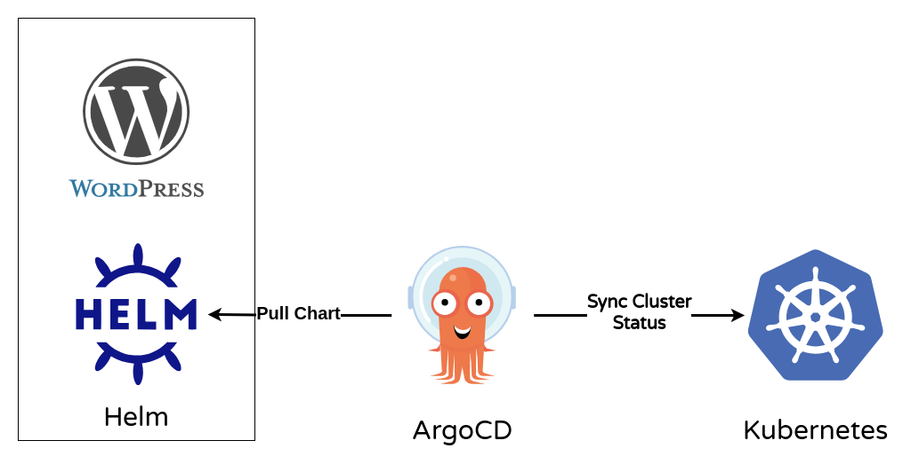

# Deploy Wordpress Helm Chart with ArgoCD

## ArgoCD Architecture


---

## Application Architecture



---

### Setup Local Kubernetes Environment (KinD) with LoadBalancer (Metallb)

Please refer to the following github repo for setting up a local kubernetes environment using KinD and LoadBalancer using Metallb.

[Create Multi-Node Local Kubernetes Cluster (KinD) with LoadBalancer (Metallb)](https://github.com/NaumanMunir9/Create-Multi-Node-Local-Kubernetes-Cluster--KinD--with-LoadBalancer--Metallb-)

---

## Project WorkFlow

### Installing ArgoCD

```shell
kubectl create namespace argocd
kubectl apply -n argocd -f https://raw.githubusercontent.com/argoproj/argo-cd/stable/manifests/install.yaml
```

```shell
k get all -n argocd
```

---

### Change the service type of "argocd-server" from "ClusterIP" to LoadBalancer

For the argocd to utilize Metallb, we have to change the service type of "argocd-server" service from "ClusterIP" to "LoadBalancer"

```shell
k edit service argocd-server -n argocd
```

```shell
k get all -n argocd
```

**Now we see that the service type of "argocd-server" service has been changed from "ClusterIP" to "LoadBalancer".**

---

### Login ArgoCD Web Interface

- ArgoCD UI admin **username**: *admin*
- ArgoCD UI admin **password**: *xxxxxxxxxxxx*

##### For retrieving ArgoCD UI admin password, paste the following command in the terminal:

```shell
k -n argocd get secret argocd-initial-admin-secret -o jsonpath="{.data.password}" | base64 -d
```

---

### Create Application

- ***SYNC POLICY***: Automatic
- **PRUNE RESOURCES**: CHECKED, Argo will delete resources if they are no longer defined in Git
- **SELF HEAL**: CHECKED, Argo will force the state defined in Git into the cluster when a deviation in the cluster is detected

***DESTINATION***

- **Cluster URL**: https://kubernetes.default.svc
- **Namespace**: default

***DIRECTORY***

- **DIRECTORY RECURSE**: CHECKED

---

### Install Wordpress Helm Chart in ArgoCD

#### Connect Repo in ArgoCD

Go to "Setting" > "Repositories" > "Connect Repo"

- CONNECT REPO USING HTTPS
  - Type: helm
  - Repository URL: https://charts.bitnami.com/bitnami

---

#### Create New App in ArgoCD

Go to "Application" > "New App"

- SOURCE
  - Repository URL: https://charts.bitnami.com/bitnami
  - Chart: wordpress

- DESTINATION
  - Cluster URL: https://kubernetes.default.svc
  - Namespace: wordpress
  - CHECK: AUTO-CREATE NAMESPACE

---

#### Cross reference that all the resources have been created in the terminal:

```shell
k get all -n wordpress
```

---

### Access Wordpress Website

```shell
k get svc wordpress-website -n wordpress 
```

**Copy the "EXTERNAL-IP" and paste in the browser.**

---

### Wordpress UI Admin Username and Password

#### Go to "EXTERNAL-IP"/admin

- Wordpress UI Admin **Username**: *user*
- Wordpress UI Admin **Password**: *xxxxxxxxxxxx*

#### For retrieving Wordpress UI admin password, paste the following command in the terminal:

The following command with return the wordpress UI admin password:

```shell
k -n wordpress get secret wordpress-website -o jsonpath="{.data.wordpress-password}" | base64 --decode
```

---
